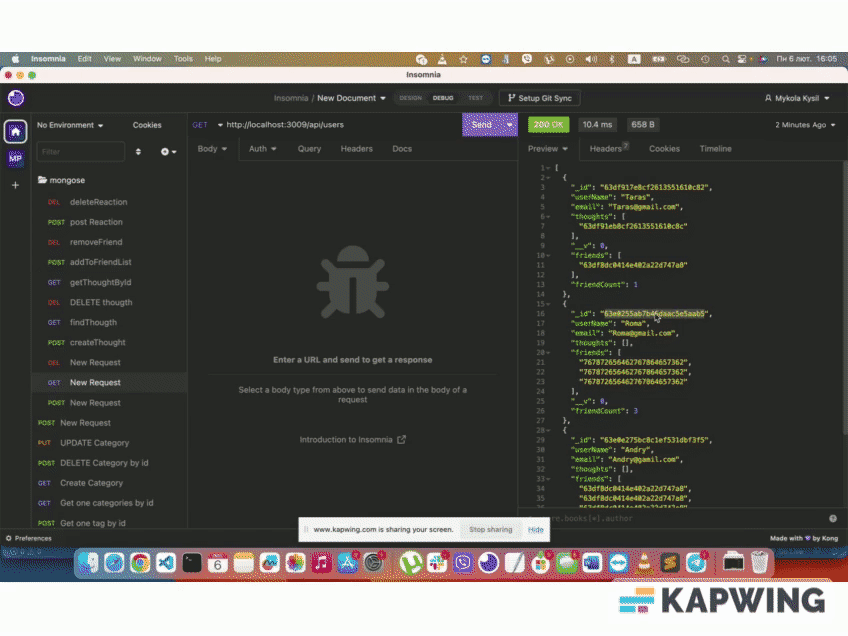
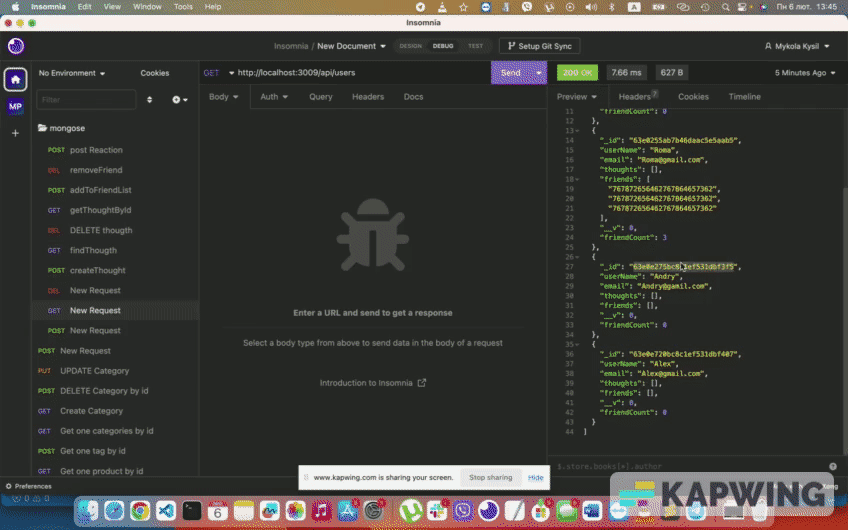

# NoSQL Social Network API

## Description

This application is for creating an API for a social media network that can handle large amounts of unstructured data utilizing a NoSQL database. The user has the ability to add, delete, get, and update users, friends of users, thoughts, and reactions on those thoughts.

## Installation

Clone the application from the command line and run 'npm i' to install the necessary dependencies, then run the command "npm start" from the command line.

## Usage

To run this application, run: npm start to use on a local server 3009 after cloning the repository and installing the necessary dependencies.

## Built With

- JavaScript
- Node JS
- NoSQL - MongoDB
- Mongoose
- Moment
- Express

## Demonstrations

## Contact Me

- Github: miklywek

- Email: miklywek@gmail.com

© 2023, Mykola Kysil
